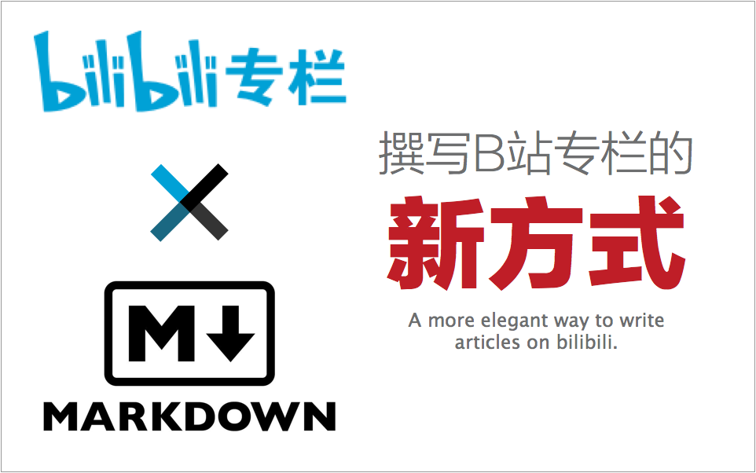

# Bilibili Zhuanlan Markdown Tool



> A useful tool for writing Markdown format on bilibili zhuanlan.
> 一款可以让你使用`Markdown`格式撰写哔哩哔哩（bilibili.com）专栏文章的辅助工具。

# Usage（使用说明）

1. Install `Node.js` environment first.

2. Install project dependencies using `npm install`.

3. Go to *bilibili.com*, set a zhuanlan article draft.

4. Get and save article's `aid` and page's `cookies` into a `.json` config file by yourself.

5. Writting with `Markdown` freely!

6. Run `node src/cli.js [md_path] [config_path]` for your own purpose.


1. 请先在本机装好`Node.js`环境。

2. 使用`npm install`安装项目依赖。

3. 前往哔哩哔哩（bilibili.com）专栏投稿区，建立一篇专栏草稿。

4. 取得文章`aid`与页面`cookies`，写入配置文件。

5. 使用`Markdown`写作吧！

6. 运行`node src/cli.js [md_path][config_path]`来提交你的`Markdown`文章。

# Configure（配置选项）

The `.json` config file of the tool is really simple, just looks like that:

程序配置文件非常简单，就像这样子：

```
{
  "aid":     "",
  "cookies": ""
}
```

For more details:

更详细的说明：

```
- aid     ->  文章标识号
- cookies -> `javascript:alert(document.cookie);`
              以下四枚 Cookie 必需, 有效期大概1个月（过期重取）
             "DedeUserID"
             "DedeUserID__ckMd5"
             "SESSDATA"
             "bili_jct"
```

# Develop（开发相关）

A short example to show how to develop with the tool.

一个利用该工具的代码小例子：

```
/*
 * API 说明
 * 参数: (Markdown 文档路径, 配置选项)
 * 处理流程: 取得 MD 文档与配置选项 -> Markdown 转换 HTML ->
 *           上传本地图片取得B站外链 -> 替换本地图片地址为B站外链地址 ->
 *           合成表单发送更新
 */
biliZhuanlanMarkdown.startProcess (
    './test.md',
    {
      "aid":     "",
      "cookies": ""
    }
);
```

# Attentions（注意事项）


# License（许可）

MIT

