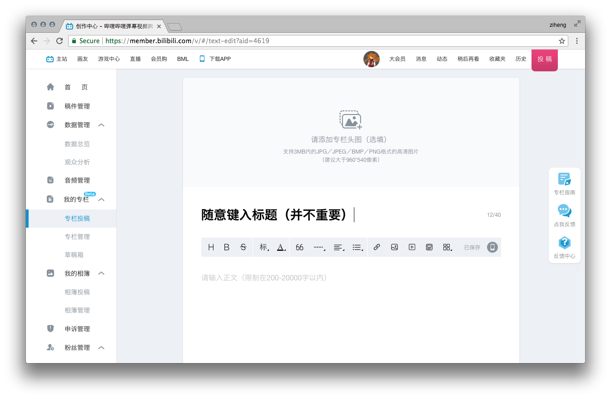
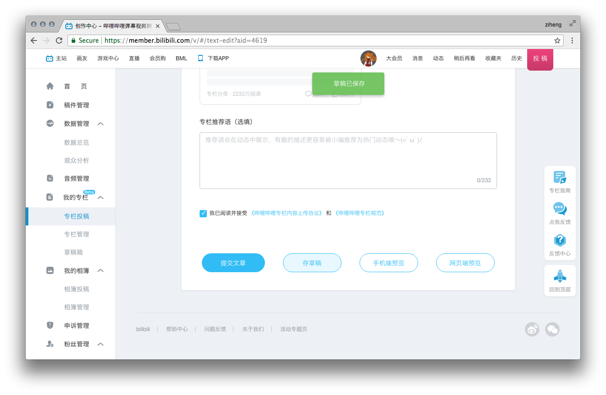
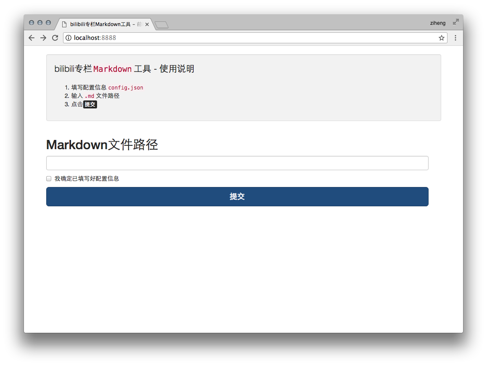
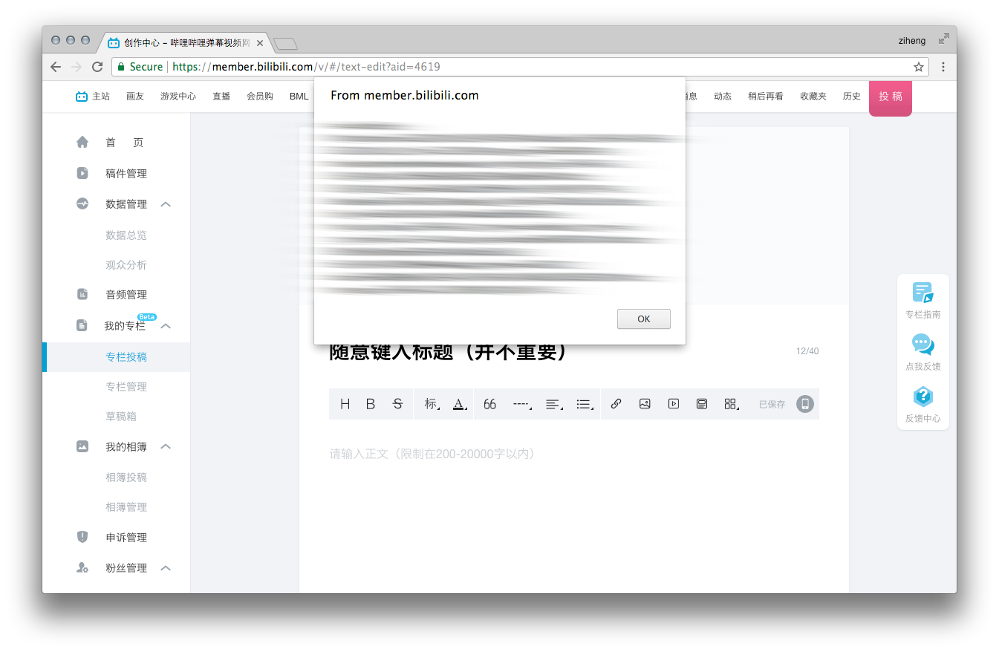
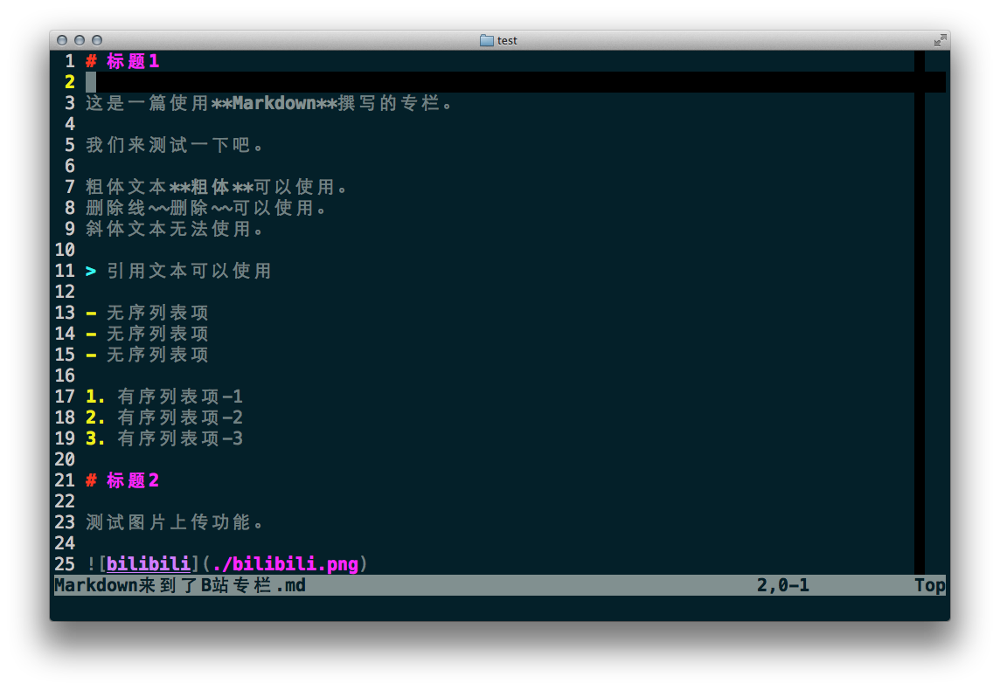

# bilibili-zhuanlan-markdown-tool


A useful tool for writing Markdown format on bilibili zhuanlan.

这是一款可以让你使用`Markdown`格式撰写哔哩哔哩（bilibili.com）专栏文章的辅助工具。

# Usage（使用说明）

## Step by step

1. Install `Node.js` environment first.

2. Install project dependencies using `npm install`.

3. Go to *bilibili.com*, set a zhuanlan article draft.

4. Get and save article's `aid` and page's `cookies` into a `.json` config file by yourself.

5. Writting with `Markdown` freely!

6. Run `node src/cli.js [md_path] [config_path]` for your own purpose.

## 使用步骤

1. 先在本机装好`Node.js`环境。

2. 使用`npm install`安装项目依赖。

3. 前往哔哩哔哩（bilibili.com）专栏投稿区，建立一篇专栏草稿。

4. 取得文章`aid`与页面`cookies`，写入配置文件。

5. 使用`Markdown`格式写作吧！

6. 运行`node src/cli.js [md_path][config_path]`来提交你的`Markdown`文章。

# Example（实例讲解）

通过一个实例，来教大家应该如何使用此工具。

## 步骤1, 2

略过，不演示，安装`Node.js`环境，添加项目依赖，没有人不会的。

## 步骤3

我们从**步骤3**开始。前往哔哩哔哩（bilibili.com）专栏投稿区，建立一篇专栏文章草稿。
键入任意文章标题，这里文章的标题并不重要，可以随意写（但不写不行，标题不写无法存草稿），我们的目的只是让一篇专栏文章成功保存草稿（即在B站服务器留下记录）。如果不确定是否成功保存，可以点击专栏编辑区下方的**存草稿**按钮。



> 图: 建立专栏文章草稿



> 图: 保存专栏文章草稿

## 步骤4

**步骤4**是至关重要的一步。我们需要**手动**取得两枚关键参数，再写出配置文件：`aid`与`cookies`。其中，`aid`是专栏文章的标识号，`cookies`用来做身份认证。只有正确取得这两枚关键参数，我们才可以与B站专栏服务器正常交互。
获取这两枚参数的方式都非常简单，`aid`在地址栏的URL参数上就有写明，而`cookies`则可以通过在目标页面键入`javascript:alert(document.cookie);`或使用开发者工具获得。



> 图: 获取`aid`



> 图: 获取`cookies`

这里我们将取得的两枚关键参数组合写成一个`.json`配置文件，配置文件的名字可以随意取。为了方便起见，我这里就将配置文件存储为`config.json`。

```
{
  "aid":     "4619",
  "cookies": "im_local_unread_1584633=0; _cnt_dyn=undefined; _cnt_pm=0; _cnt_notify=0; uTZ=-480; user_face=https%3A%2F%2Fi1.hdslb.com%2Fbfs%2Fface%2F6924d7e00ab833cc20bc97c7d4147308b84464ae.jpg; finger=0e029071; buvid3=9800BBA9-3DE9-4C50-99B1-29ABE518D62E59218infoc; im_seqno_1584633=22; CURRENT_QUALITY=15"
}
```

## 步骤5

至此，所有准备工作均已完成。现在，我们可以告别B站专栏富文本编辑器，转而使用`Markdown`格式撰写文章了。**拿起你最钟爱的`Markdown`编辑器，愉快地写作吧！**



> 图: `Markdown`格式文章

## 步骤6

最后，我们来将这篇`Markdown`格式的文章**变身**成为B站专栏文章。键入命令来提交你的`Markdown`文章，将你的文章与配置文件一并输入，注意先后顺序。

```
$ node src/cli.js './test/Markdown来到了B站专栏.md' './test/config.json'
```
我们回到专栏草稿箱看一看，我们会发现，这篇`Markdown`格式的文章已经变身成为B站专栏文章了，文章的大标题正是`Markdown`文件名。


> 图: 由`Markdown`变身而成的专栏文章（网页端预览）

预览文章，添加头图，选择分类，写专栏推荐语，这些都是文章发布前的准备工作。完成后就可以提请发布文章啦。当然，B站肯定是要审核的啦。

# Attentions（注意事项）

有一些注意事项是你一定要知道的。

## 不支持的Markdown语法

目前，B站专栏所能提供的功能选项还非常有限，甚至连基础`Markdown`语法标准都无法达到。对于下列`Markdown`可以使用的功能选项（甚至是常用选项），B站专栏目前都还无法提供支持。至于扩展`Markdown`功能，不要想啦...没有的。

- 六级标题
- 斜体文本
- 超链接
- 外链图片
- 代码块
- 表格
- 内联HTML

所以，如果你考虑将`Markdown`文章发布到B站专栏上，请**谨慎使用**上述语法格式，并考虑替代方案（如: 使用图片替换表格，代码块）。

## 专有功能

另外，B站也针对自家的专栏文章添加了一些**专有**功能选项，这些选项大多是B站专栏的特色。

- 字号
- 对齐
- 颜色
- 图片分割线
- 站内超链接
- 站内选项卡

这些选项大多没有合适的`Markdown`语法与之对应，只能通过**内联HTML**实现。

如果你分析过B站专栏的文章结构，就会明白，这些专有功能都是通过`class样式 + 行内CSS样式`实现的，并不具备可移植性，也不符合**结构与样式分离**的原则。

这款工具并不对这些专有功能提供支持。

# Configure（配置选项）

The `.json` config file of the tool is really simple, just looks like that:

程序配置文件非常简单，就像这样子：

```
{
  "aid":     "",
  "cookies": ""
}
```

For more details:

更详细的说明：

```
- aid     ->  文章标识号
- cookies -> `javascript:alert(document.cookie);`
              以下四枚 Cookie 必需, 有效期大概1个月（过期重取）
             "DedeUserID"
             "DedeUserID__ckMd5"
             "SESSDATA"
             "bili_jct"
```

# Develop（开发相关）

A short example to show how to develop with the tool.

一个利用该工具的代码小例子：

```
/*
 * API 说明
 * 参数: (Markdown 文档路径, 配置选项)
 * 处理流程: 取得 MD 文档与配置选项 -> Markdown 转换 HTML ->
 *           上传本地图片取得B站外链 -> 替换本地图片地址为B站外链地址 ->
 *           合成表单发送更新
 */
biliZhuanlanMarkdown.startProcess (
    './test.md',
    {
      "aid":     "",
      "cookies": ""
    }
);
```

# License（许可协议）

[MIT](./LICENSE)

